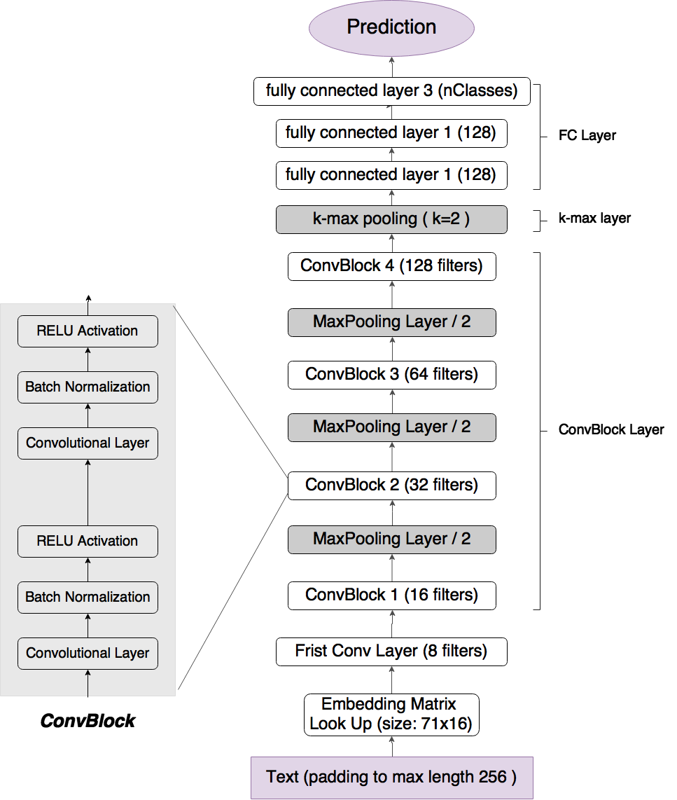
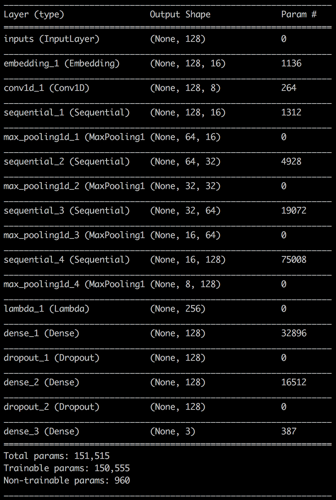

# Deep Character-Level Convolutional Neural Network For Text Classification #

### Framework



### Summary



References
----------

1. [Convolutional Neural Networks for Sentence Classification](https://arxiv.org/abs/1408.5882) proposed by Yoon Kim in 2014

2. [Character-level Convolutional Networks for Text Classification](https://arxiv.org/abs/1509.01626) proposed by Xiang Zhang, Junbo Zhao, Yann LeCun in 2015

3. [VERY DEEP CONVOLUTIONAL NETWORKS FOR LARGE-SCALE IMAGE RECOGNITION](https://arxiv.org/abs/1409.1556) proposed by Karen Simonyan and Andrew Zisserman in 2014


Prerequisites
-------------

- python 2.7
- numpy
- [Tensorflow](https://www.tensorflow.org/)
- [Keras](https://github.com/fchollet/keras)


Usage
-----

To train a model

    $ python run.py --mode=train --num_epochs=1000 --learning_rate=0.0001 --verbose --checkpoint_dir=checkpoints --tensorboard

To predic a model

    $ python run.py --mode=pred --checkpoint_dir=checkpoints


All options:
```
usage: run.py [-h] [--n_sentiment_classes N_SENTIMENT_CLASSES]
              [--n_content_classes N_CONTENT_CLASSES]
              [--num_epochs NUM_EPOCHS] [--batch_size BATCH_SIZE]
              [--learning_rate LEARNING_RATE] [--optimizer OPTIMIZER]
              [--input_data INPUT_DATA] [--test_data TEST_DATA]
              [--checkpoint_dir CHECKPOINT_DIR] [--output_dir OUTPUT_DIR]
              [--streamer STREAMER] [--embedding_size EMBEDDING_SIZE]
              [--max_feature_length MAX_FEATURE_LENGTH]
              [--evaluate_every EVALUATE_EVERY]
              [--checkpoint_every CHECKPOINT_EVERY]
              [--l2_weight_decay L2_WEIGHT_DECAY] --mode MODE
              [--load_model LOAD_MODEL] [--verbose] [--print_summary]
              [--load_pretrain] [--tensorboard]

optional arguments:
  -h, --help            show this help message and exit
  --n_sentiment_classes N_SENTIMENT_CLASSES
                        Specify number of classes of sentiments
  --n_content_classes N_CONTENT_CLASSES
                        Specify number of classes of comments
  --num_epochs NUM_EPOCHS
                        Specify number of epochs
  --batch_size BATCH_SIZE
                        Batch size. Must divide evenly into the dataset sizes.
  --learning_rate LEARNING_RATE
                        Specify learning rate
  --optimizer OPTIMIZER
                        Specify optimizer
  --input_data INPUT_DATA
                        Location store the input data (only accept `csv`
                        format)
  --test_data TEST_DATA
                        Specify test data path
  --checkpoint_dir CHECKPOINT_DIR
                        Specify checkpoint directory
  --output_dir OUTPUT_DIR
                        Directory to store the summaries and checkpoints.
  --streamer STREAMER   Specify a twitch streamer
  --embedding_size EMBEDDING_SIZE
                        Specify embedding size
  --max_feature_length MAX_FEATURE_LENGTH
                        Specify max feature length
  --evaluate_every EVALUATE_EVERY
                        do evaluation after # numbers of training steps
  --checkpoint_every CHECKPOINT_EVERY
                        Save checkpoint after # numbers of training steps
  --l2_weight_decay L2_WEIGHT_DECAY
                        Specify max feature length
  --mode MODE           Specify mode: `train` or `eval` or `pred`
  --load_model LOAD_MODEL
                        Specify the location of model weights
  --verbose             Verbose on training
  --print_summary       Print out model summary
  --load_pretrain       Whether load pretrain model weights
  --tensorboard         Whether use tensorboard or not
```


